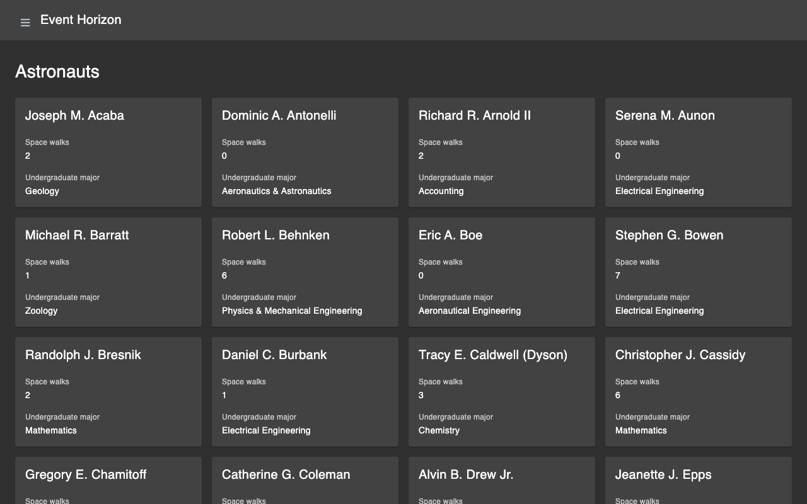
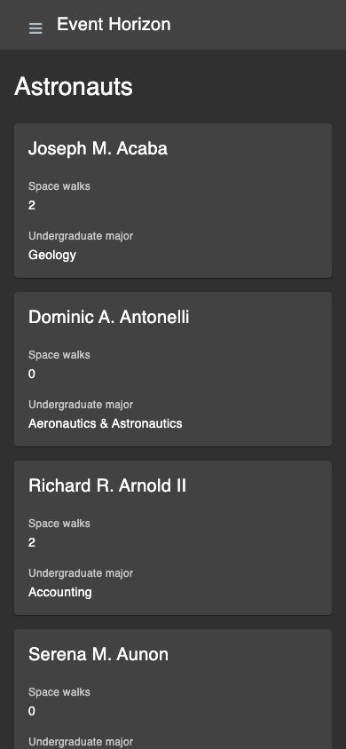

# Event Horizon

An astronaut browsing interface with a dark card grid and a nested services menu. This Angular UI demo uses 50 bundled astronaut records and does not require an account or backend.

## What you can do

- Browse astronaut names, spacewalk counts, and undergraduate majors.
- Open and close the navigation drawer.
- Explore the nested services menu.

## Preview



Captured from the running application on September 30, 2026. Any sample records shown are demonstration or isolated test data, not data included with a fresh installation.

<details>
<summary>Mobile view</summary>



</details>

## Run locally

Use the Node version in `.nvmrc` (currently 26.10.0) and npm. Run these commands from the repository root.

```sh
nvm use  # if you manage Node with nvm
npm ci
npm start
```

Open [http://127.0.0.1:4200](http://127.0.0.1:4200). Keep the server in the foreground; stop it with **Ctrl+C**.

## Current scope

Search/filter controls and animal menu actions are interface placeholders. Menu navigation is implemented; it does not invoke external services. The bundled directory works offline after installation.

## Development

```sh
npm run build
npm run typecheck
npm test -- --browsers=ChromeHeadless
```

Browser tests require Chrome or Chromium; set `CHROME_BIN` if it is outside the standard installation path. Angular 22 currently requires TypeScript 6.0.x. The Jasmine 6 test dependencies are retained for compatibility with Zone.js.
